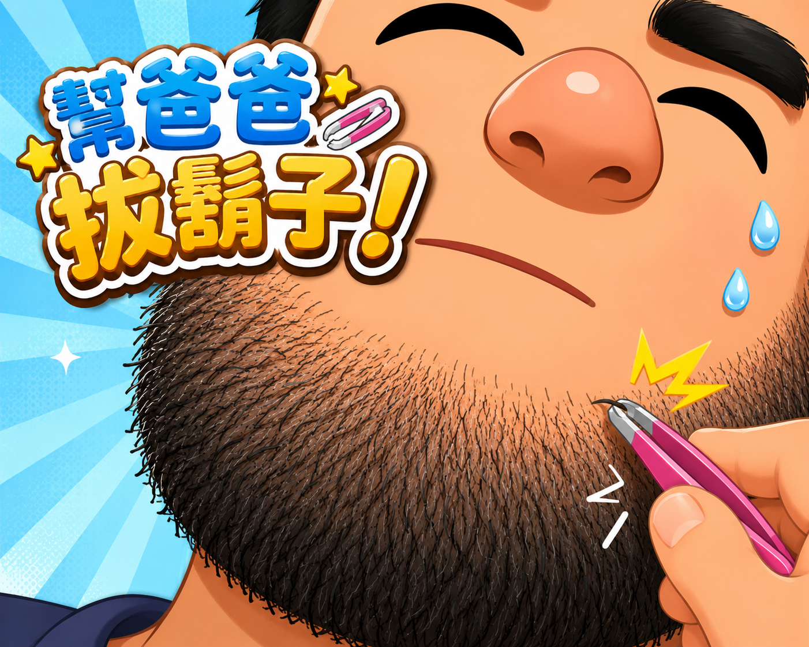

# 節奏幫爸爸拔鬍子

<p align="center">
  <b>看爸爸長鬍子，聽小鼓出題，照節奏把鬍子拔掉！</b><br />
  一款用 HTML Canvas 製作的可愛節奏小遊戲。
</p>

<p align="center">
  <a href="https://www.threads.com/@lycbert">Threads</a>
  ·
  <a href="https://www.youtube.com/@datoemusic">YouTube</a>
  ·
  <a href="#玩法">玩法</a>
  ·
  <a href="#github-pages-部署">部署教學</a>
</p>

<p align="center">
  
  
  
</p>

---

## 🎮 遊戲介紹

**《節奏幫爸爸拔鬍子》** 是一款網頁版節奏遊戲。

遊戲會先用小鼓聲出題，爸爸會照著節奏長出鬍子；接著換玩家照同樣的節奏輸入，把剛剛長出的鬍子拔掉。

節奏玩法是：

```text
出題階段：小鼓聲 + 長鬍子
答題階段：玩家照節奏拔鬍子
```

簡單、直覺、可愛，而且有點荒謬。

---

## ✨ 特色

- 🖼️ **滿版首頁背景圖**
- 🎵 **首頁 / 規則頁 BGM**
- 🥁 **小鼓聲出題**
- 🧔 **爸爸依照節奏長鬍子**
- 🪒 **玩家照節奏拔鬍子**
- 🔵 **長按音符：按住鬍子，到結尾放開**
- 🧑‍🦱 **參考附圖風格的爸爸角色**
- 📱 **支援鍵盤、滑鼠、觸控**
- 🖥️ **自動符合視窗大小**
- 🔁 **結算後可再玩一次**

---

## 🖼️ 遊戲畫面

### 首頁

<p align="center">
  
</p>


---

## 🕹️ 玩法

| 操作 | 說明 |
|---|---|
| `Space` | 拔鬍子 |
| 長按 `Space` | 拉住長鬍子，結尾放開 |
| 滑鼠點擊 | 拔鬍子 |
| 滑鼠長按 | 長按鬍子 |
| 觸控 | 手機 / 平板操作 |
| `F11` | 建議進入全螢幕取得更好體驗 |

---

## 🧭 遊戲流程

```mermaid
flowchart TD
  A[首頁] --> B[按 Start]
  B --> C[規則說明頁]
  C --> D[我懂了，開始遊戲]
  D --> E[聽小鼓示範]
  E --> F[爸爸長鬍子]
  F --> G[玩家照節奏拔鬍子]
  G --> H[結算]
  H --> I[再玩一次]
  I --> D


## 📁 專案結構

```text
.
├── rhythm_pluck_game_updated.html   # 主要遊戲檔案
├── rhythm_pluck_game.html           # 備用版本
├── README.md
└── assets/
    ├── home_background.png          # 首頁背景圖
    ├── thumbnail.png                # GitHub / 社群分享縮圖
    └── home_bgm.mp3                 # 首頁與規則頁 BGM
```

  <b>🥁 聽節奏，拔鬍子，幫爸爸變清爽！</b>
</p>
